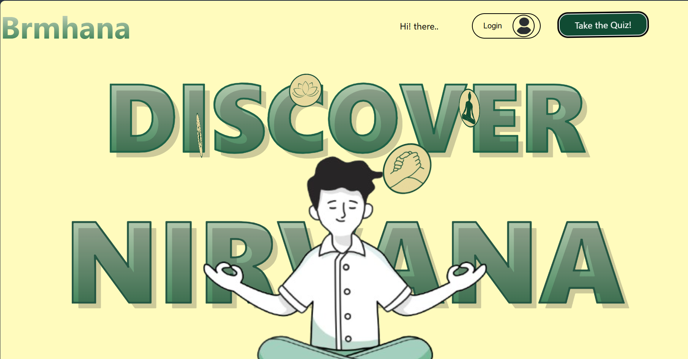

# 🧠 Brmhana – A Mental Health Web App for Empowerment & Support

**Brmhana** is a modern mental health web application built with **React.js**, created to break cultural and accessibility barriers around mental health. It provides a secure and anonymous space where users can connect, reflect, and grow.


---

## 🧩 Problem Addressed

Millions suffer silently due to **lack of accessibility**, **cultural stigma**, and **privacy concerns** surrounding mental health. Brmhana is developed to address these challenges and offer accessible, personalized, and stigma-free mental wellness support.

---

## 💡 Key Features – Empowering Users and Fostering Wellness

### 1. 🗣️ Anonymous Forums
Users can connect with others **completely anonymously** to share experiences and seek advice without fear of judgment. A safe space to speak freely.

### 2. 🧑‍⚕️ Custom Therapist Matching
A personalized system matches users with **psychiatrists or therapists** based on preferences, needs, and specialties — ensuring the right fit.

### 3. 🔐 Confidentiality & Security
Brmhana uses **advanced security practices** to protect user data. Your privacy is our top priority.

### 4. 🎓 Psychologist Guidance
**Trainee psychologists** monitor forums to ensure conversations stay constructive, safe, and emotionally supportive.

### 5. 📊 Daily Mental Health Checks
Interactive daily check-ins help users **track emotional well-being** and understand their mental health journey over time.

---

## ⚙️ Tech Stack

- **Frontend:** React.js, React Router, Axios
- **Styling:** Tailwind CSS / CSS Modules (optional)
- **APIs:** Custom backend or integration-ready (e.g., Firebase, Node.js)
- **Authentication:** Optional JWT/Auth0/Firebase Auth

---

## 🚀 Getting Started

### 1. Clone the Repository

```bash
git clone https://github.com/your-username/brmhana.git
cd brmhana
